```markdown
# Zesty OS

<div align="center">


**The Next Generation Human AI Operating System**

[](https://python.org)
[](https://flask.palletsprojects.com)
[](https://www.trychroma.com)
[](https://github.com/rany2/edge-tts)
[](LICENSE)
[](https://github.com)
[](CONTRIBUTING.md)
[](docs/)

<br/>

[Features](#-features) •
[Architecture](#-architecture) •
[Installation](#-installation) •
[Roadmap](#-roadmap) •
[Documentation](#-documentation-index) •
[Contributing](#-contributing)

</div>

---

## 📖 Table of Contents

| Section | Description |
|---------|-------------|
| [About Zesty OS](#-about-zesty-os) | Vision, philosophy and core principles |
| [Why Zesty OS Exists](#-why-zesty-os-exists) | Founder story and the problems being solved |
| [Features](#-features) | Complete feature matrix |
| [Architecture](#-architecture) | System design with Mermaid diagrams |
| [Functional Flow](#-functional-flow) | End-to-end request lifecycle |
| [Tech Stack](#-current-tech-stack) | Current and planned technologies |
| [Folder Structure](#-folder-structure) | Enterprise repository layout |
| [Installation](#-installation) | Windows, macOS, Linux, Docker |
| [Configuration](#-configuration--environment-variables) | Environment variables and settings |
| [API Overview](#-api-overview) | Core endpoints and contracts |
| [Development Guide](#-development-guide) | Local development workflow |
| [Roadmap](#-roadmap) | 2026–2028 phased plan |
| [Security](#-security) | Threat model and hardening |
| [Contributing](#-contributing) | How to contribute |
| [Code of Conduct](#-code-of-conduct) | Community standards |
| [FAQ](#-faq) | Frequently asked questions |
| [Troubleshooting](#-troubleshooting) | Common issues and solutions |
| [About the Creator](#-about-the-creator) | Founder and company |
| [License](#-license) | MIT License |

---

## 🌟 About Zesty OS

**Zesty OS** is an AI Operating System built from the ground up to create a genuinely human-like digital assistant.

It is not another chatbot wrapper.  
It is not a thin interface over a single LLM.  
It is a modular, memory-first, persona-driven system designed to feel continuous, adaptive, and alive.

Traditional AI assistants suffer from fundamental limitations:

- They forget previous conversations after a few turns  
- They lack consistent personality  
- They reply in a robotic, generic tone  
- They have almost no emotional intelligence  
- Their long-term memory is either non-existent or poorly implemented  
- Context retention across sessions is weak  
- Automation and workflow capabilities remain limited  

Zesty OS was created to address these exact problems.

### Core Design Pillars

| Pillar | Description |
|--------|-------------|
| **Human Conversations** | Natural, multi-turn dialogue with emotional awareness |
| **Persistent Memory** | Working memory + long-term memory with retrieval |
| **Emotional Intelligence** | Emotion engine that influences tone and response style |
| **AI Personas** | Pluggable personality layer (OpenPersona) |
| **Local + Cloud AI** | Hybrid routing between local models and cloud providers |
| **Modular Architecture** | Clean separation of concerns for extensibility |
| **Productivity & Automation** | Workflow engine and future multi-agent support |
| **Voice Interaction** | Real-time speech synthesis via Edge TTS |
| **AI Workflows** | Structured pipelines for complex tasks |

The long-term vision is clear: **build a complete AI Operating System**, not another chat interface.

---

## 💡 Why Zesty OS Exists

### The Founder Story

I am Sanjay Darnal, a hospitality professional, mixologist, and bar consultant based in Goa, India. For more than twelve years I have worked in environments that demand precision, empathy, storytelling, and real-time human connection.

When large language models became widely available, I immediately saw both their power and their limitations. The tools were impressive, yet they felt incomplete. They could generate fluent text, but they could not remember who I was across days. They could answer questions, but they could not develop a consistent personality. They could follow instructions, but they could not adapt to my working style or emotional state.

I kept running into the same set of frustrations:

- Conversations reset every time I opened a new session  
- Personality was either absent or forced through brittle system prompts  
- Emotional tone was flat and repetitive  
- Long-term context was either lost or clumsily summarized  
- Automation required constant re-explanation of the same goals  

I did not want another chatbot.  
I wanted an assistant that could **remember**, **understand**, **learn**, **adapt**, **speak naturally**, and **grow with the user**.

Zesty OS is the result of that desire. It is an attempt to treat AI not as a stateless text generator, but as a continuous operating system for human–AI collaboration.

The project is still early. Many components are under active development. The architecture, however, is deliberately designed for longevity: modular, observable, and extensible.

---

## ✨ Features

### Core Capabilities

| Feature | Status | Description |
|---------|--------|-------------|
| **Conversation Manager** | Active | Orchestrates multi-turn dialogue, turn tracking, and session state |
| **Working Memory** | Active | Short-term context buffer for the current conversation |
| **Long-Term Memory** | Active | ChromaDB-backed persistent vector store |
| **Context Awareness** | Active | Retrieval-augmented context injection before every generation |
| **Emotion Engine** | In Progress | Lightweight affect detection that modulates response style |
| **Personality Engine** | Active | OpenPersona layer for consistent character and voice |
| **Voice Assistant** | Active | Edge TTS integration for natural speech synthesis |
| **AI Routing** | Active | Dynamic selection between NVIDIA NIM, Groq, and local models |
| **RAG Pipeline** | Active | Document ingestion, chunking, embedding, and retrieval |
| **Document Search** | Active | Semantic search over user-uploaded knowledge |
| **Knowledge Base** | Active | Structured storage of facts, preferences, and history |
| **Plugin System** | Planned | Extensible hook system for custom tools and skills |
| **Automation** | Planned | Workflow engine for multi-step tasks |
| **Productivity Tools** | Planned | Calendar, task, and note integrations |
| **Developer APIs** | Active | REST API for external clients and integrations |
| **Multi-Agent** | Future | Coordinated agent teams for complex goals |

### Memory System Highlights

- **Working Memory**: In-memory conversation buffer with sliding window  
- **Long-Term Memory**: ChromaDB collections for episodic, semantic, and preference memory  
- **Context Retrieval**: Hybrid search (vector + keyword) with relevance scoring  
- **Memory Writing**: Automatic extraction of durable facts after each conversation  

### Voice & Interaction

- Streaming and non-streaming TTS via Edge TTS  
- Configurable voice personas  
- Future support for local TTS models and voice cloning  

### AI Provider Flexibility

Current providers:  
- NVIDIA NIM  
- Groq  

Planned:  
- Google Gemini  
- OpenAI  
- Anthropic Claude  
- Local models (Llama, Qwen, Mistral, DeepSeek) via Ollama / llama.cpp / MLX  

---

## 🏗 Architecture

Zesty OS follows a clean, layered, modular architecture. Every major concern is isolated so that components can be developed, tested, and replaced independently.

### Overall System Architecture

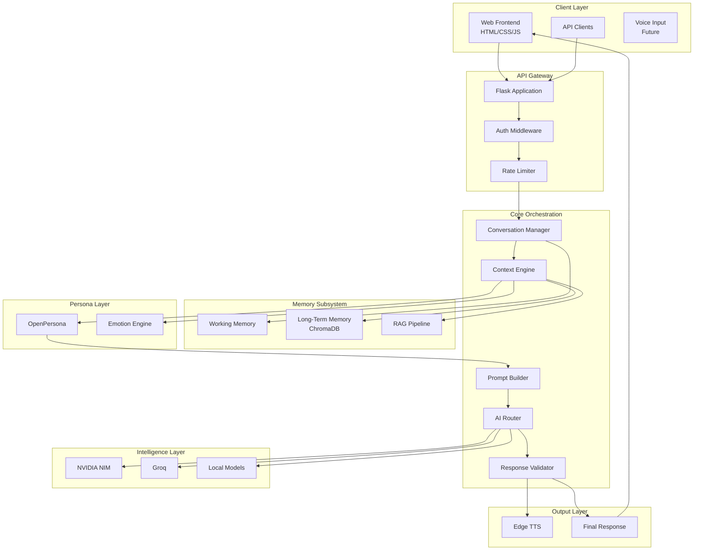

### Memory Architecture

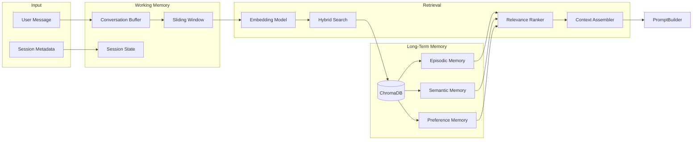

### Conversation Architecture

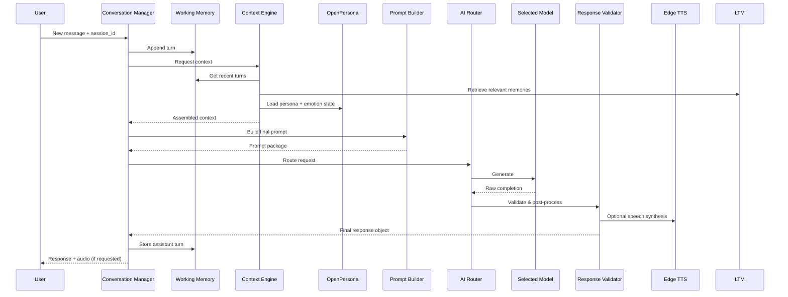

### RAG Pipeline

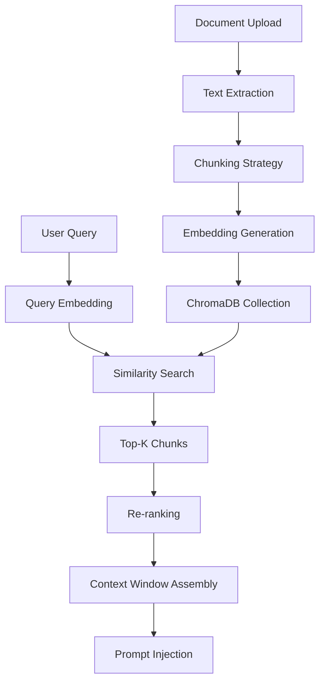

### Prompt Flow

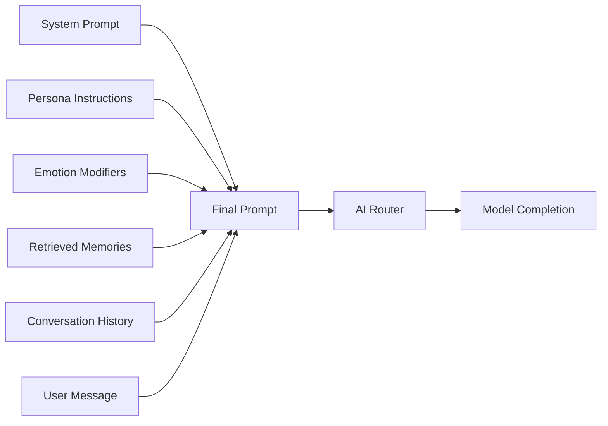

### Voice Pipeline

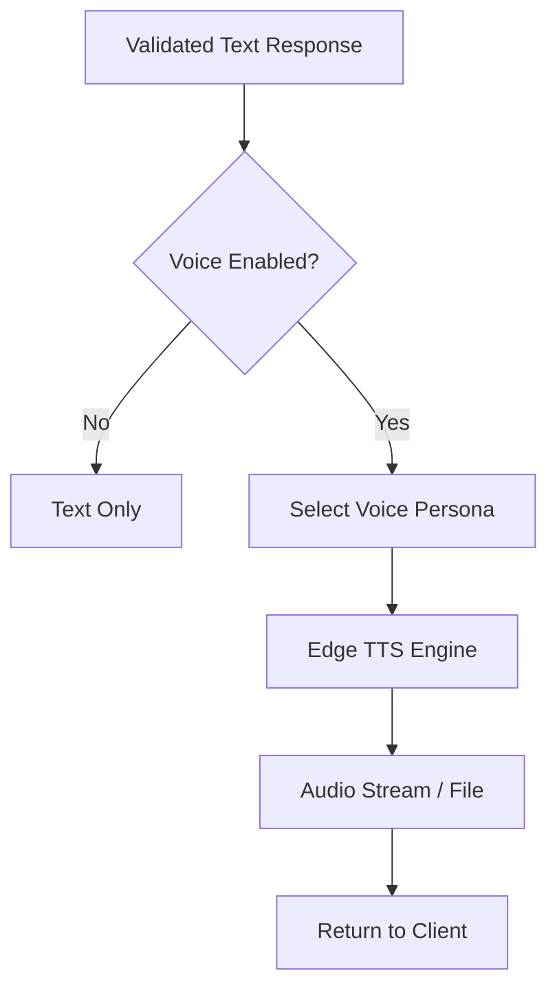

### AI Router

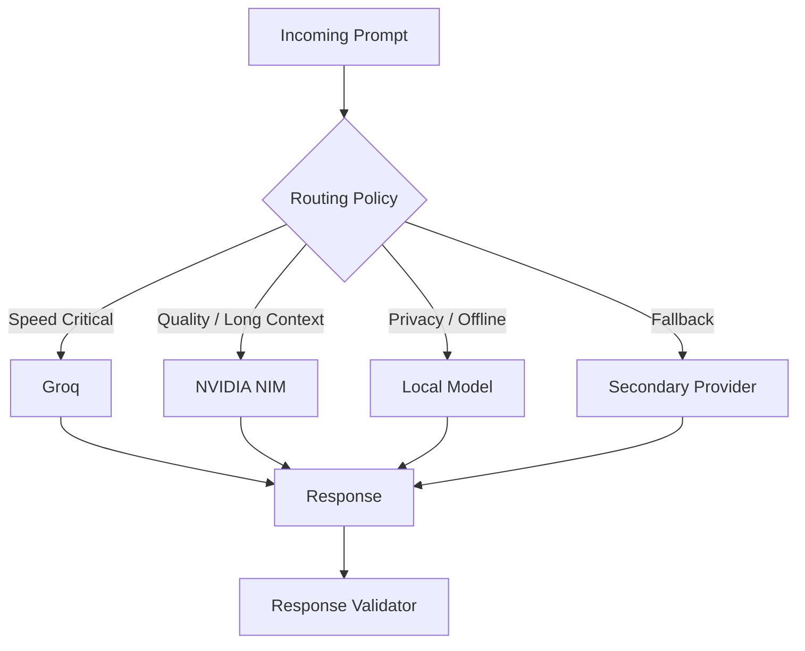

### Persona Layer

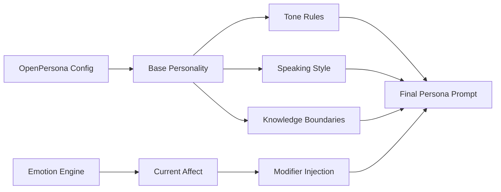

### Context Engine

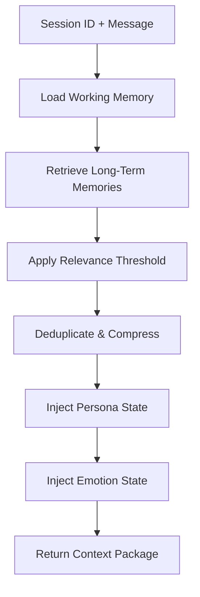

### Response Pipeline

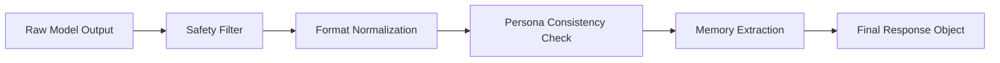

### API Layer

```mermaid
flowchart TB
    subgraph Public API
        A1[/v1/chat]
        A2[/v1/memory]
        A3[/v1/voice]
        A4[/v1/documents]
        A5[/v1/persona]
    end

    subgraph Internal
        B1[Conversation Service]
        B2[Memory Service]
        B3[Voice Service]
        B4[RAG Service]
        B5[Persona Service]
    end

    A1 --> B1
    A2 --> B2
    A3 --> B3
    A4 --> B4
    A5 --> B5
```

### Future Multi-Agent Architecture

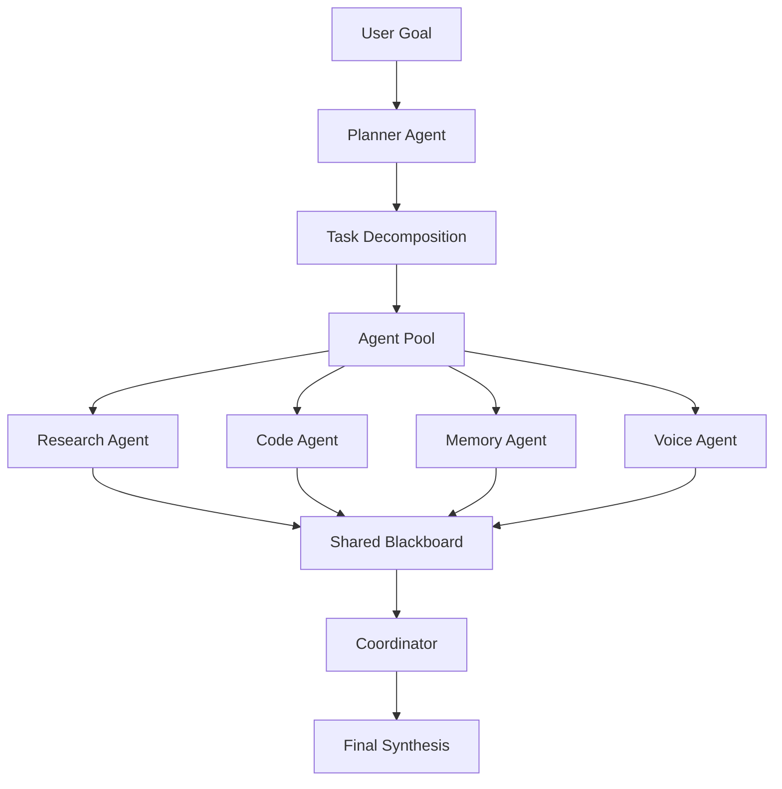

### Deployment Architecture

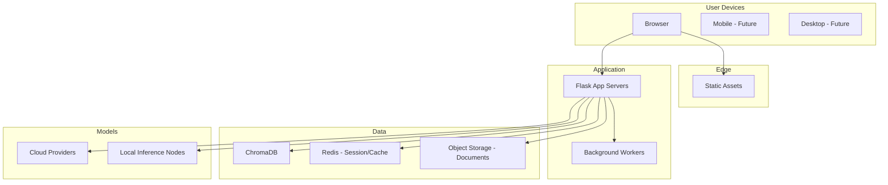

### Folder Architecture

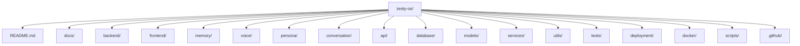

### Data Flow (End-to-End)

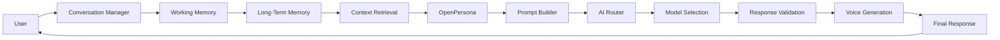

---

## 🔄 Functional Flow

The canonical request lifecycle inside Zesty OS:

```
User
 ↓
Conversation Manager
 ↓
Working Memory
 ↓
Long-Term Memory
 ↓
Context Retrieval
 ↓
OpenPersona
 ↓
Prompt Builder
 ↓
AI Router
 ↓
Model Selection
 ↓
Response Validation
 ↓
Voice Generation
 ↓
Final Response
```

Each stage is intentionally isolated. This makes the system observable, testable, and easy to extend.

---

## 🛠 Current Tech Stack

### Frontend
| Technology | Purpose |
|------------|---------|
| HTML5 | Structure |
| CSS3 | Styling & theming |
| JavaScript (Vanilla) | Interactivity & API client |

### Backend
| Technology | Purpose |
|------------|---------|
| Python 3.10+ | Primary language |
| Flask | HTTP API & application server |

### Memory
| Technology | Purpose |
|------------|---------|
| ChromaDB | Vector store for long-term memory & RAG |

### Persona
| Technology | Purpose |
|------------|---------|
| OpenPersona | Personality and character layer |

### Voice
| Technology | Purpose |
|------------|---------|
| Edge TTS | Text-to-speech synthesis |

### AI Providers (Current)
| Provider | Role |
|----------|------|
| NVIDIA NIM | High-quality inference |
| Groq | Low-latency inference |

### AI Providers (Planned)
| Provider | Role |
|----------|------|
| Google Gemini | Alternative cloud model |
| OpenAI | Alternative cloud model |
| Anthropic Claude | Alternative cloud model |

### Local Models (Planned / Experimental)
| Model Family | Notes |
|--------------|-------|
| Llama | Meta open models |
| Qwen | Alibaba open models |
| Mistral | Mistral AI models |
| DeepSeek | DeepSeek models |

---

## 📁 Folder Structure

```text
zesty-os/
├── README.md
├── LICENSE
├── CODE_OF_CONDUCT.md
├── CONTRIBUTING.md
├── SECURITY.md
├── .env.example
├── requirements.txt
├── pyproject.toml
│
├── docs/
│   ├── architecture.md
│   ├── installation.md
│   ├── deployment.md
│   ├── api.md
│   ├── development.md
│   ├── roadmap.md
│   ├── faq.md
│   ├── security.md
│   └── troubleshooting.md
│
├── backend/
│   ├── __init__.py
│   ├── app.py
│   ├── config.py
│   ├── extensions.py
│   └── wsgi.py
│
├── frontend/
│   ├── index.html
│   ├── css/
│   ├── js/
│   └── assets/
│
├── memory/
│   ├── __init__.py
│   ├── working.py
│   ├── long_term.py
│   ├── embeddings.py
│   └── chroma_client.py
│
├── voice/
│   ├── __init__.py
│   ├── tts.py
│   └── personas.py
│
├── persona/
│   ├── __init__.py
│   ├── open_persona.py
│   ├── emotion.py
│   └── profiles/
│
├── conversation/
│   ├── __init__.py
│   ├── manager.py
│   ├── session.py
│   └── turn.py
│
├── api/
│   ├── __init__.py
│   ├── routes/
│   │   ├── chat.py
│   │   ├── memory.py
│   │   ├── voice.py
│   │   ├── documents.py
│   │   └── persona.py
│   └── schemas/
│
├── database/
│   ├── __init__.py
│   └── migrations/
│
├── models/
│   ├── __init__.py
│   └── providers/
│       ├── base.py
│       ├── nvidia_nim.py
│       ├── groq.py
│       └── local.py
│
├── services/
│   ├── __init__.py
│   ├── context_engine.py
│   ├── prompt_builder.py
│   ├── ai_router.py
│   ├── response_validator.py
│   └── rag.py
│
├── utils/
│   ├── __init__.py
│   ├── logging.py
│   ├── security.py
│   └── helpers.py
│
├── tests/
│   ├── unit/
│   ├── integration/
│   └── e2e/
│
├── deployment/
│   ├── nginx/
│   ├── systemd/
│   └── k8s/
│
├── docker/
│   ├── Dockerfile
│   ├── docker-compose.yml
│   └── docker-compose.dev.yml
│
├── scripts/
│   ├── setup.sh
│   ├── migrate.py
│   └── seed_memory.py
│
└── .github/
    ├── workflows/
    │   ├── ci.yml
    │   └── release.yml
    ├── ISSUE_TEMPLATE/
    └── PULL_REQUEST_TEMPLATE.md
```

---

## 🚀 Installation

### Prerequisites

- Python 3.10 or higher
- Git
- (Optional) Docker & Docker Compose
- (Optional) CUDA-capable GPU for local models

### 1. Clone the Repository

```bash
git clone https://github.com/your-org/zesty-os.git
cd zesty-os
```

### 2. Create a Virtual Environment

**Linux / macOS**
```bash
python3 -m venv .venv
source .venv/bin/activate
```

**Windows**
```powershell
python -m venv .venv
.venv\Scripts\activate
```

### 3. Install Dependencies

```bash
pip install -r requirements.txt
```

### 4. Environment Variables

Copy the example file and edit it:

```bash
cp .env.example .env
```

Minimum required variables:

```env
# Flask
FLASK_ENV=development
SECRET_KEY=change-me-in-production

# AI Providers
NVIDIA_NIM_API_KEY=
GROQ_API_KEY=

# Memory
CHROMA_PERSIST_DIRECTORY=./data/chroma

# Voice
EDGE_TTS_VOICE=en-US-AriaNeural
```

### 5. Run the Application

```bash
python -m backend.app
```

The API will be available at `http://127.0.0.1:5000`.

### Docker Installation

```bash
docker compose -f docker/docker-compose.yml up --build
```

### Platform-Specific Notes

| Platform | Notes |
|----------|-------|
| **Windows** | Use PowerShell or WSL2. Edge TTS works natively. |
| **macOS** | Fully supported. Apple Silicon works with current stack. |
| **Linux** | Recommended for production. Use systemd unit files in `deployment/`. |

---

## ⚙️ Configuration & Environment Variables

| Variable | Required | Default | Description |
|----------|----------|---------|-------------|
| `FLASK_ENV` | No | `production` | `development` or `production` |
| `SECRET_KEY` | Yes | — | Flask secret key |
| `NVIDIA_NIM_API_KEY` | Conditional | — | Required if using NVIDIA NIM |
| `GROQ_API_KEY` | Conditional | — | Required if using Groq |
| `CHROMA_PERSIST_DIRECTORY` | No | `./data/chroma` | Path for ChromaDB persistence |
| `EDGE_TTS_VOICE` | No | `en-US-AriaNeural` | Default TTS voice |
| `LOG_LEVEL` | No | `INFO` | Logging verbosity |
| `MAX_CONTEXT_TOKENS` | No | `8192` | Soft limit for context assembly |

---

## 📡 API Overview

All endpoints are prefixed with `/v1`.

### Chat

```
POST /v1/chat
```

Request body:
```json
{
  "session_id": "uuid",
  "message": "Hello Zesty",
  "voice": false,
  "persona": "default"
}
```

### Memory

```
GET  /v1/memory/{session_id}
POST /v1/memory
DELETE /v1/memory/{memory_id}
```

### Voice

```
POST /v1/voice/synthesize
```

### Documents (RAG)

```
POST /v1/documents/upload
GET  /v1/documents
POST /v1/documents/search
```

### Persona

```
GET  /v1/persona
PUT  /v1/persona/{name}
```

Full OpenAPI specification will live in `docs/api.md` and will be served at `/docs` in future releases.

---

## 🧑‍💻 Development Guide

1. Fork and clone the repository  
2. Create a feature branch: `git checkout -b feature/my-feature`  
3. Install development dependencies: `pip install -r requirements-dev.txt`  
4. Run tests: `pytest`  
5. Follow the existing code style (Black + isort + Ruff)  
6. Write clear commit messages  
7. Open a pull request against `main`

### Local Development Tips

- Use `FLASK_ENV=development` for auto-reload  
- ChromaDB data is stored under `./data/chroma` by default  
- Voice synthesis requires network access for Edge TTS  

---

## 🗺 Roadmap

### 2026

| Phase | Focus | Key Deliverables |
|-------|-------|------------------|
| **Phase 1 – Core AI** | Solid foundation | Conversation Manager, AI Router, basic providers |
| **Phase 2 – Memory** | Persistent intelligence | Working + Long-Term Memory, ChromaDB integration, context engine |
| **Phase 3 – Voice** | Natural interaction | Edge TTS pipeline, voice personas, streaming support |

### 2027

| Phase | Focus | Key Deliverables |
|-------|-------|------------------|
| **Phase 4 – Vision** | Multimodal input | Image understanding, screenshot context |
| **Phase 5 – Agents** | Multi-agent system | Planner, specialized agents, shared blackboard |
| **Phase 6 – Automation** | Workflow engine | Task graphs, scheduled jobs, external tool calling |

### 2028

| Phase | Focus | Key Deliverables |
|-------|-------|------------------|
| **Phase 7 – Plugin Marketplace** | Extensibility | Plugin SDK, discovery, sandboxing |
| **Phase 8 – Mobile Apps** | Reach | iOS & Android clients |
| **Phase 9 – Desktop Apps** | Native experience | macOS, Windows, Linux applications |
| **Phase 10 – Enterprise** | Production scale | SSO, audit logs, multi-tenant, SLA support |

---

## 🔒 Security

- All API keys are loaded from environment variables  
- No secrets are committed to the repository  
- Input validation on every public endpoint  
- Rate limiting middleware  
- Response validation layer before returning content to the user  
- Future: authentication, authorization, and encrypted memory at rest  

See [SECURITY.md](SECURITY.md) for the full policy and how to report vulnerabilities.

---

## 🤝 Contributing

We welcome contributions of all kinds: code, documentation, design, testing, and ideas.

Please read [CONTRIBUTING.md](CONTRIBUTING.md) before opening a pull request.

### Quick Contribution Checklist

- [ ] Code follows project style  
- [ ] Tests pass  
- [ ] Documentation updated if needed  
- [ ] Commit messages are clear  
- [ ] PR description explains the change  

---

## 📜 Code of Conduct

This project follows a standard Code of Conduct.  
Be respectful. Be constructive. Be kind.

Full text: [CODE_OF_CONDUCT.md](CODE_OF_CONDUCT.md)

---

## ❓ FAQ

**Is Zesty OS production-ready?**  
Not yet. It is under active development. Core conversation and memory loops are functional; many advanced features are still in progress.

**Can I run it fully offline?**  
Partially. Local model support is planned. Current voice synthesis (Edge TTS) requires network access.

**Which models work best?**  
Groq is excellent for speed. NVIDIA NIM is preferred for quality. Local models will be first-class citizens.

**How is memory stored?**  
Working memory is in-process. Long-term memory uses ChromaDB on disk.

**Can I add my own persona?**  
Yes. Personas are defined as configuration and can be extended.

---

## 🛠 Troubleshooting

| Problem | Possible Cause | Solution |
|---------|----------------|----------|
| `ModuleNotFoundError` | Virtual environment not activated | Activate `.venv` |
| ChromaDB permission error | Directory not writable | Check `CHROMA_PERSIST_DIRECTORY` permissions |
| TTS fails | Network or voice name invalid | Verify internet and `EDGE_TTS_VOICE` |
| Empty responses | Missing API keys | Set `NVIDIA_NIM_API_KEY` or `GROQ_API_KEY` |
| High latency | Wrong provider selected | Switch to Groq for speed |

More detailed guidance is available in `docs/troubleshooting.md`.

---

## 👤 About the Creator

**Sanjay Darnal**  
Founder, Craftsmen & Co.

- Hospitality Professional  
- Mixologist  
- Bar Consultant  
- AI Builder  
- Software Enthusiast  
- Entrepreneur  

**Experience**: 12+ years  
**Location**: Goa, India  

**Mission**: Building practical AI systems that combine real-world usability with intelligent software.

---

## 🏢 Company

**Craftsmen & Co.** is the company behind Zesty OS.

It began as a hospitality and bar consultancy focused on beverage innovation, menu engineering, and experiential design. Over time the company has expanded into AI software, automation, and digital product development — applying the same principles of precision, storytelling, and human experience to intelligent systems.

---

## 📬 Contact

| Channel | Details |
|---------|---------|
| **Email** | sanjaydarnal7@gmail.com |
| **Phone** | +91 8766540537 |
| **Instagram** | [@sanjay_darnal25](https://instagram.com/sanjay_darnal25) |
| **Business Instagram** | [@craftsmen_co_](https://instagram.com/craftsmen_co_) |
| **LinkedIn** | [Sanjay Darnal](https://www.linkedin.com/in/sanjay-darnal-mixologist) |
| **Business** | Craftsmen & Co. Bar Consultancy |

---

## 📄 License

This project is licensed under the **MIT License**.  
See the [LICENSE](LICENSE) file for the full text.

---

## 📚 Documentation Index

| Document | Description |
|----------|-------------|
| [Architecture](docs/architecture.md) | Deep dive into system design |
| [Installation](docs/installation.md) | Detailed setup instructions |
| [Deployment](docs/deployment.md) | Production deployment guides |
| [API Documentation](docs/api.md) | Endpoint reference |
| [Development Guide](docs/development.md) | Contributor workflow |
| [Roadmap](docs/roadmap.md) | Long-term plan |
| [FAQ](docs/faq.md) | Common questions |
| [Security](docs/security.md) | Security policy |
| [Troubleshooting](docs/troubleshooting.md) | Debugging help |

---

<div align="center">

**Zesty OS** — The Next Generation Human AI Operating System

Built with intention in Goa, India.

[⬆ Back to top](#zesty-os)

</div>
```
